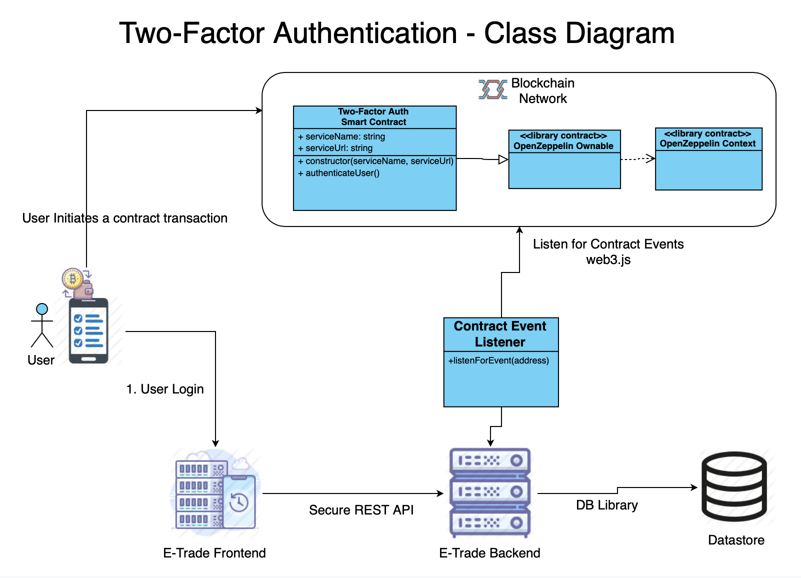

# Lab - 7

- UML class diagrams are used to represent smart contracts and struct datatype.
- Like a class, a smart contract can have a data structure, public and private functions, and can inherit from one or more smart contracts.
- Create a class diagram for the smart contracts based on the user stories that you submitted in Lab - 4.
- You can use this tool to create the class diagram.

## Diagram

